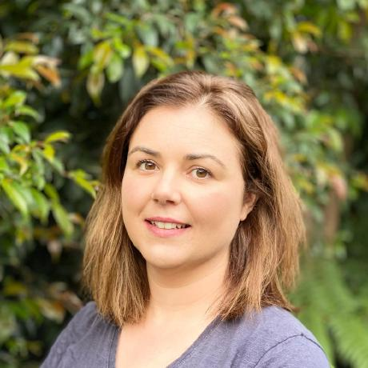

  * Senior Bioinformatician, The University of Melbourne/Australian Biocommons
  * Science Lead, Galaxy Australia
  * Most of my work is with Galaxy Australia - a webpage (connected to computing resources) where people can analyse data.

<a href="#peer-reviewed-publications" style="display:inline-block; background-color:#3565a5; color:white; padding:8px 16px; border-radius:8px; text-decoration:none; margin:4px 2px; font-size:14px;">Peer-reviewed publications</a>
<a href="#conferences-seminars-workshops" style="display:inline-block; background-color:#3565a5; color:white; padding:8px 16px; border-radius:8px; text-decoration:none; margin:4px 2px; font-size:14px;">Conferences, seminars, workshops</a>
<a href="#galaxy-training-network-tutorials" style="display:inline-block; background-color:#3565a5; color:white; padding:8px 16px; border-radius:8px; text-decoration:none; margin:4px 2px; font-size:14px;">Galaxy Training Network tutorials</a>
<a href="#galaxy-top-tips-youtube-series" style="display:inline-block; background-color:#3565a5; color:white; padding:8px 16px; border-radius:8px; text-decoration:none; margin:4px 2px; font-size:14px;">Galaxy Top Tips</a>
<a href="#zenodo-tutorials-and-datasets" style="display:inline-block; background-color:#3565a5; color:white; padding:8px 16px; border-radius:8px; text-decoration:none; margin:4px 2px; font-size:14px;">Zenodo tutorials and datasets</a>
<a href="#workflowhub-workflows" style="display:inline-block; background-color:#3565a5; color:white; padding:8px 16px; border-radius:8px; text-decoration:none; margin:4px 2px; font-size:14px;">WorkflowHub workflows</a>
<a href="#iwc-workflows" style="display:inline-block; background-color:#3565a5; color:white; padding:8px 16px; border-radius:8px; text-decoration:none; margin:4px 2px; font-size:14px;">IWC workflows</a>
<a href="#galaxy-australia-published-workflows" style="display:inline-block; background-color:#3565a5; color:white; padding:8px 16px; border-radius:8px; text-decoration:none; margin:4px 2px; font-size:14px;">Galaxy Australia published workflows</a>
<a href="#professional-memberships-and-reviewing" style="display:inline-block; background-color:#3565a5; color:white; padding:8px 16px; border-radius:8px; text-decoration:none; margin:4px 2px; font-size:14px;">Professional memberships and reviewing</a>
<a href="#books" style="display:inline-block; background-color:#3565a5; color:white; padding:8px 16px; border-radius:8px; text-decoration:none; margin:4px 2px; font-size:14px;">Books</a>
<a href="#theses" style="display:inline-block; background-color:#3565a5; color:white; padding:8px 16px; border-radius:8px; text-decoration:none; margin:4px 2px; font-size:14px;">Theses</a>
<a href="#community-engagement" style="display:inline-block; background-color:#3565a5; color:white; padding:8px 16px; border-radius:8px; text-decoration:none; margin:4px 2px; font-size:14px;">Community engagement</a>

## Peer-reviewed publications

- Simpson L, et al. [incl. **Syme AE**]. (2025). The Genomics for Australian Plants (GAP) framework initiative—developing genomic resources for understanding the evolution and conservation of the Australian flora. Australian Systematic Botany 38(3). [doi:10.1071/SB24022](https://doi.org/10.1071/SB24022)
- Hyde C, **Syme AE**, Batut B, Zierep PF, Mok W, Bacon WA, Price GR. (2025). Community-curated Galaxy interfaces with the Galaxy Labs Engine. Submitted to GigaScience. Preprint: [doi:10.20944/preprints202508.0199.v1](https://doi.org/10.20944/preprints202508.0199.v1)
- The Galaxy Community [incl. **Syme AE**]. (2024). The Galaxy platform for accessible, reproducible, and collaborative data analyses: 2024 update. Nucleic Acids Research 52(W1): W83–W94. [doi:10.1093/nar/gkae410](https://doi.org/10.1093/nar/gkae410)
- Brown T, et al. [incl. **Syme AE**]. (2024). Genome annotation and other post-assembly workflows for the Tree of Life. BioHackrXiv preprint. [doi:10.37044/osf.io/vvadp](https://doi.org/10.37044/osf.io/vvadp)
- Mu A, et al. [incl. **Syme AE**]. (2023). Integrative omics identifies conserved and pathogen-specific responses of sepsis-causing bacteria. Nature Communications 14: 1530. [doi:10.1038/s41467-023-37200-w](https://doi.org/10.1038/s41467-023-37200-w)
- Hiltemann S, et al. [incl. **Syme AE**]. (2023). Galaxy Training: a powerful framework for teaching! PLOS Computational Biology 19(1): e1010752. [doi:10.1371/journal.pcbi.1010752](https://doi.org/10.1371/journal.pcbi.1010752)
- The Galaxy Community [incl. **Syme AE**]. (2022). The Galaxy platform for accessible, reproducible and collaborative biomedical analyses: 2022 update. Nucleic Acids Research 50(W1): W13–W51. [doi:10.1093/nar/gkac247](https://doi.org/10.1093/nar/gkac247)
- **Syme AE**, McLay TGB, Udovicic F, Cantrill DJ, Murphy DJ. (2021). Long-read assemblies reveal structural diversity in genomes of organelles – an example with Acacia pycnantha. Gigabyte. [doi:10.46471/gigabyte.36](https://doi.org/10.46471/gigabyte.36)
- Georgeson P, **Syme AE**, et al. (2019). Bionitio: demonstrating and facilitating best practices for bioinformatics command-line software. GigaScience 8(9): giz109. [doi:10.1093/gigascience/giz109](https://doi.org/10.1093/gigascience/giz109)
- Minhas V, et al. [incl. **Syme AE**]. (2019). Capacity to utilize raffinose dictates pneumococcal disease phenotype. mBio 10(1): e02596-18. [doi:10.1128/mBio.02596-18](https://doi.org/10.1128/mBio.02596-18)
- Foster CSP, et al. [incl. **Syme AE**]. (2016). Molecular phylogenetics provides new insights into the systematics of Pimelea and Thecanthes (Thymelaeaceae). Australian Systematic Botany 29: 185–196. [doi:10.1071/SB16013](https://doi.org/10.1071/SB16013)
- McCallum AW, et al. [incl. **Syme AE**]. (2014). Productivity enhances benthic species richness along an oligotrophic Indian Ocean continental margin. Global Ecology and Biogeography. [doi:10.1111/geb.12255](https://doi.org/10.1111/geb.12255)
- Poore GCB, et al. [incl. **Syme AE**]. (2014). Invertebrate diversity of the unexplored marine western margin of Australia: taxonomy and implications for global biodiversity. Marine Biodiversity 45: 271–286. [doi:10.1007/s12526-014-0255-y](https://doi.org/10.1007/s12526-014-0255-y)
- **Syme AE**, Udovicic F, Stajsic V, Murphy DJ. (2013). A test of sequence-matching algorithms for a DNA barcode database of invasive grasses. DNA Barcodes 1: 19–26. [doi:10.2478/dna-2012-0002](https://doi.org/10.2478/dna-2012-0002)
- **Syme AE**, Oakley TH. (2012). Dispersal between shallow and abyssal seas and evolutionary loss and re-gain of ostracod compound eyes in cylindroleberidid ostracods. Systematic Biology 61(2): 314–336. [doi:10.1093/sysbio/syr085](https://doi.org/10.1093/sysbio/syr085)
- **Syme AE**. (2012). Diversification rates in the Australasian endemic grass Austrostipa – 15 million years of constant evolution. Plant Systematics and Evolution 298(1): 221–227. [doi:10.1007/s00606-011-0529-z](https://doi.org/10.1007/s00606-011-0529-z)
- **Syme AE**, Murphy DJ, Holmes GD, Gardner S, Fowler R, Cantrill DC. (2012). An expanded phylogenetic analysis of Austrostipa (Poaceae: Stipeae) to test infrageneric relationships. Australian Systematic Botany 25: 1–10. [doi:10.1071/SB11016](https://doi.org/10.1071/SB11016)
- Lebel T, **Syme AE**. (2012). Sequestrate Agaricus and Macrolepiota from Australia: new combinations and species, and their position in a calibrated phylogeny. Mycologia 104: 496–520. [doi:10.3852/11-078](https://doi.org/10.3852/11-078)
- Jenkins GP, **Syme AE**, Macreadie PI. (2011). Feeding ecology of King George whiting Sillaginodes punctatus recruits in seagrass and unvegetated habitats. Journal of Fish Biology 78: 1561–1573. [doi:10.1111/j.1095-8649.2011.02978.x](https://doi.org/10.1111/j.1095-8649.2011.02978.x)
- Rivera AS, et al. [incl. **Syme AE**]. (2010). Gene duplication and the origins of morphological complexity in pancrustacean eyes, a genomic approach. BMC Evolutionary Biology 10: 123. [doi:10.1186/1471-2148-10-123](https://doi.org/10.1186/1471-2148-10-123)
- **Syme AE**, Poore GCB. (2008). A supplementary description of Cypridina mariae, type species of Cylindroleberis, and rediagnosis of the genus (Ostracoda: Myodocopa: Cylindroleberididae). PLoS ONE 3(4): e1960. [doi:10.1371/journal.pone.0001960](https://doi.org/10.1371/journal.pone.0001960)
- Lum KE, **Syme AE**, Schwab AK, Oakley TH. (2008). Euphilomedes chupacabra (Ostracoda: Myodocopida: Philomedidae), a new demersal marine species from coastal Puerto Rico with male-biased vespertine swimming activity. Zootaxa 1684: 35–57. [doi:10.11646/zootaxa.1684.1.2](https://doi.org/10.11646/zootaxa.1684.1.2)
- **Syme AE**, Poore GCB. (2006). Three new species of the Cylindroleberididae from coastal Australian waters (Crustacea: Ostracoda). Zootaxa 1305: 51–67. [doi:10.11646/zootaxa.1305.1.5](https://doi.org/10.11646/zootaxa.1305.1.5)
- **Syme AE**, Poore GCB. (2006). A checklist for species of the Cylindroleberididae (Crustacea: Ostracoda). Museum Victoria Science Reports 9: 1–20. [doi:10.24199/j.mvsr.2006.09](https://doi.org/10.24199/j.mvsr.2006.09)

## Conferences, seminars, workshops

- **Syme AE**. (2023, 2024, 2025). Asia-Pacific regional lead for the Galaxy Training Academy (GTA). Galaxy Training Academy, annual international event. The 2024 event attracted over 3,000 participants; the 2025 event reached a record 3,574 from 122 countries.
- **Syme AE**. (2025). Co-technical lead for Galaxy Australia at the Singapore Biology League (SBL 2025): approximately 500 student teams used Galaxy Australia for a major competition practical, 12 July 2025. Singapore Biology League, Singapore, July 2025. [sgbioleague.org](https://sgbioleague.org)
- **Syme AE**. (2025). The Power of Workflows in Galaxy Australia. Talk with live demonstration. Australian BioCommons Genomics Community Meeting, March 2025.
- **Syme AE**. (2024). Galaxy Australia: genome assembly workflows. Demonstration. Fungi Bioinformatics Workshop, Australian BioCommons / Galaxy Australia, 2024.
- Price G, [Galaxy Australia team incl. **Syme AE**], et al. (2024). Talk (Price G presenter). State of Galaxy Australia. Galaxy Community Conference (GCC2024), Brno, Czech Republic, June 2024. **Syme AE** recognized for IWC (Intergalactic Workflow Commission) contributions to high-quality workflows and for contribution to ELIXIR's 2023 Biohackathon ([https://www.biocommons.org.au/blogs/gcc2024](https://www.biocommons.org.au/blogs/gcc2024)).
- Nelson, TM, et al. [incl. **Syme AE**] (2024). Poster (Nelson T presenter). Establishing genomics infrastructure for Australian researchers. ELIXIR All-Hands Meeting, Uppsala, Sweden, June 2024. [https://f1000research.com/posters/13-607](https://f1000research.com/posters/13-607)
- Silver L, **Syme AE**, Ward N, Hogg C. (2024). Talk (Silver L presenter). Empowering Bioinformaticians and Conservation Managers: Generating Workflow Solutions in Galaxy. Genetics Society of Australasia Conference, Macquarie University, June 30 – July 3, 2024. [https://genetics.org.au/wp-content/uploads/2025/03/GSA24_AbstractBook_Oficial.pdf](https://genetics.org.au/wp-content/uploads/2025/03/GSA24_AbstractBook_Oficial.pdf)
- Connolly K, et al. [incl. **Syme AE**]. (2023, 2024). Galaxy Australia – making use of national and commercial GPGPU resources. Talk (co-author; Connolly K presenter). eResearch Australasia, Brisbane, October 2023; eResearch Australasia, Melbourne, October–November 2024.
- **Syme AE** et al. (2024). BPA Functional Fungi bioinformatics workshop. Workshop (co-lead trainer) for 38 researchers. Australian National University, Canberra, November 2024. Developed customised training materials and six template workflows spanning QC through annotation and comparative genomics; delivered eight hands-on Galaxy sessions. All materials, 15 example histories and six workflows published on Zenodo (December 2024; >1,200 downloads). Link: [https://zenodo.org/records/14498677](https://zenodo.org/records/14498677) [doi:10.5281/zenodo.14498676](https://doi.org/10.5281/zenodo.14498676)
- Nelson TM, et al. [incl. **Syme AE**] (2024). Establishing genomics infrastructure for the Australian research community. Poster. Galaxy Community Conference (GCC2024), F1000Research 2024, 13(ELIXIR):607. [doi:10.7490/F1000RESEARCH.1119744.1](https://doi.org/10.7490/F1000RESEARCH.1119744.1)
- **Syme AE**, et al. (2023). Poster. Building a Galaxy Lab for genomics. Galaxy Community Conference (GCC2023), Brisbane, July 2023. Scientific Program Committee member.
- Brown T, et al. [incl. **Syme AE**]. (2023). Genome annotation workflows for the Tree of Life. BioHackathon Europe, Barcelona, October–November 2023. Led Australian team. Outputs: preprint [doi:10.37044/osf.io/vvadp](https://doi.org/10.37044/osf.io/vvadp)
- **Syme AE**, Bassetti M, Mok W, Hyde C, Ward N, Price G. (2023). Making bioinformatics more user-friendly with custom interfaces. Talk (Price G, presenter). International Conference on Bioinformatics (InCoB), 2023.
- **Syme AE**. (2023). Melbourne Bioinformatics workshops (mid-2023): Introduction to Galaxy and Galaxy Workflows; Introduction to Galaxy and Quality Control. Workshops (presenter). Melbourne Bioinformatics, University of Melbourne, 2023.
- Price G, **Syme AE**. (2022). Bioinformatics Training: Galaxy Global Platform for the Analysis of SARS-CoV-2 Data and Variants. Training session. 53rd Meeting of the Asia Pacific Advanced Network (APAN53), Bangladesh (online/hybrid), 7 March 2022. Coordinated by eResearch Network for South East Asia (eRSEA). [apan53.apan.net](https://apan53.apan.net)
- **Syme AE**, et al. (2021). Driving workforce transition in Australian life science research. Poster. Galaxy Community Conference (GCC2021), July 2021 (online). Scientific Program Committee member. Workshop (presenter): Genome Assembly – lecture and hands-on tutorial (**Syme AE**, Gladman S).
- **Syme AE**. (2021). Assembling genomes on Galaxy Australia. Presentation. Australian BioCommons Showcase, Melbourne, 4 November 2021. Panelist: Galaxy Partnerships – Partnering with the international community (Ward N, Price G, Gladman S, **Syme AE**).
- **Syme AE**. (2021). What can long reads tell us about genome structure? Presentation. Melbourne Bioinformatics Group Meeting, March 2021.
- **Syme AE**. (2021). Asia/Pacific Facilitator for several multi-day international Galaxy workshops: Galaxy Smorgasbord training week (>1,000 participants); SARS-CoV-2 Data Analysis and Monitoring with Galaxy; Plant Transcriptomics with Galaxy.
- **Syme AE**, et al. (2021). Driving workforce transition in Australian life science research. Poster. Galaxy Community Conference, F1000Research. [doi:10.7490/f1000research.1118591.1](https://doi.org/10.7490/f1000research.1118591.1)
- Pope B, et al. [incl. **Syme AE**]. (2020). Best practices in bioinformatics command-line software with Bionitio. Talk (co-author; Pope B presenter). ABACBS Annual Conference, November 2020 (online).
- **Syme AE**. (2020). What do researchers want to know? Presentation. Australian BioCommons BYOD Project Presentation, November 2020.
- Pope B, **Syme AE**. (2020). Bionitio – building better bioinformatics tools with batteries included. Workshop (co-presenter). Bioinformatics Community Conference (BCC2020), 18 July 2020.
- **Syme AE**. (2020). Chloroplast genome assembly using Galaxy Australia. Webinar. Australian BioCommons, 10 December 2020.
- Pope B, et al. [incl. **Syme AE**]. (2020). Bionitio. Talk (co-author; Pope B presenter). Bioinformatics Community Conference (BCC), July 2020 (online).
- **Syme AE**. (2020). GAP Reference Genomes Pilot. Presentation. BioPlatforms Australia Facilities Meeting, May 2020.
- Price G, et al. [incl. **Syme AE**]. (2019). Galaxy Australia – inside the national vision of a data commons. Talk (co-author; Price G presenter). Galaxy Community Conference (GCC2019), Freiburg, Germany, 2 July 2019. Session chair: Transcriptomics and Genomics (3 July 2019).
- Hiltemann S, et al. [incl. **Syme AE**]. (2019). Train the Galaxy Trainer. Workshop (co-presenter). Galaxy Community Conference (GCC2019), Freiburg, Germany, 3 July 2019. Overview: [gcc2019.sched.com/event/MDTV](https://gcc2019.sched.com/event/MDTV)
- Lariviere D, **Syme AE**. (2019). Assembly and annotation of bacterial genomes. Workshop (co-presenter). Galaxy Community Conference (GCC2019), Freiburg, 4 July 2019. Program: [tinyurl.com/assemblyworkshop-GCC2019](https://tinyurl.com/assemblyworkshop-GCC2019)
- Session co-chair: Plant genomics. Australasian Genomic Technologies Association (AGTA) Conference, Melbourne, 8 October 2019.
- Pope B, **Syme AE**, Cameron D. (2018). Best practices in bioinformatics software development. Workshop (co-presenter). ABACBS Conference, Melbourne, 30 November 2018.
- Price G, et al. [incl. **Syme AE**]. (2018). Enabling Australian Genomics research through enhancements to the Genomics Virtual Lab. Talk (co-author; Price G presenter). eResearch Australasia Conference, Melbourne, October 2018.
- **Syme AE**. (2018). Long-read genome assembly. Workshop (presenter/developer). Melbourne Bioinformatics Genome Assembly Workshop, October 2018 (**Syme AE**, Seemann T, Gladman S) and March 2018 (**Syme AE**, Seemann T).
- **Syme AE**. (2018). National Hybrid Training. Workshop (developer and co-presenter). Galaxy Australia / Australian BioCommons, 2018. Four workshops across Australia: (1) Genome Assembly and Annotation, 22 August; (2) Finding Genetic Variants in Bacterial Sequence Data, 12 September; (3) Differential Gene Expression from Bacterial RNA-Seq Data, 23 October; (4) Metagenomics, 14 November. Facilitator Training for Hybrid Training, Melbourne, 26–27 July.
- Pope B, **Syme AE**. (2018). Bionitio for bioinformatics command-line software. Workshop (co-presenter). Melbourne Bioinformatics, July 2018.
- **Syme AE**, et al. (2017). Galaxy training for microbial genomics. Poster (presenter). ABACBS Annual Conference, Adelaide, November 2017.
- **Syme AE**. (2017). Building genomics tutorials in Galaxy, for biologists. Talk (presenter). Galaxy Australasia Meeting (GAMe), Melbourne, February 2017.
- Kwong JC, et al. [incl. **Syme AE**]. (2017). Combined genomic and epidemiological investigation of a state-wide, multi-institution outbreak of KPC-producing Enterobacteriaceae. Poster (co-author). European Congress of Clinical Microbiology and Infectious Diseases (ECCMID), Vienna, April 2017.
- **Syme AE**. (2017). Long-read genome assembly. Workshop (presenter/developer). Melbourne Bioinformatics Genome Assembly Workshop, October 2017.
- Gladman S, **Syme AE**. (2017). Galaxy, Assembly, Annotation, Useful tools, Moving data, Variant calling. Workshop (co-presenter). Genomics Workshop for Faculty of Veterinary and Agricultural Sciences, University of Melbourne, November 2017.
- Gladman S, **Syme AE**. (2017). Bacterial genomics using the Galaxy platform. Workshop (co-presenter). Genomics Workshop for Intersect, Sydney, December 2017.
- **Syme AE**. (2017). The Genomics Virtual Laboratory and Omics Platform. Workshop/demonstration (presenter). eResearch South Australia, Adelaide, April 2017.
- **Syme AE**. (2017). Genome size from k-mer counting. Melbourne Bioinformatics, September 2017.
- **Syme AE**. (2016). Using DNA to understand eye evolution. Melbourne Bioinformatics, June 2016.
- **Syme AE**. (2016). Complete genomes from long and short reads. Melbourne Bioinformatics, October 2016.
- **Syme AE**, Seemann T, Gladman S, Bulach D. (2016). Complete genomes: the long and the short of it. Poster (presenter). ABACBS Annual Conference, Brisbane, November 2016. Published: F1000Research 5: 2589. [doi:10.7490/f1000research.1113338.1](https://doi.org/10.7490/f1000research.1113338.1)
- **Syme AE**, Seemann T, Gladman S, Bulach D, et al. (2016). RDS Omics Training Material – antibiotic resistant pathogens. Project update (presenter). RDS/BPA Omics Consortium Meeting, Melbourne, November 2016.
- Gladman S, **Syme AE**. (2016). A next-generation sequencing workshop: assembly, annotation, variant calling. Workshop (co-presenter). UWA Microbial Genomics Workshop, Perth, November 2016. Event: [combine.org.au](https://combine.org.au)
- **Syme AE**, Stefani F. (2012). Phylogenetic methods using BEAST, R and Geneious. Presentation and workshop. Melbourne Systematics Forum, May 2012.
- **Syme AE**, Udovicic F. (2011). Investigating rbcL gene duplication in grasses. Talk (presenter). Session chair: Barcoding Grasses. Fourth International Barcode of Life Conference, Adelaide, 2011.
- **Syme AE**, Udovicic F. (2011). A multi-gene study of relationships within the Australian grass genus Austrostipa. Talk (presenter). XVIII International Botanical Congress, Melbourne, 2011. Also: co-author on two additional talks at the same congress.
- **Syme AE**, Oakley TH. (2008). How quickly are eyes lost? A phylogenetic study of deep sea and shallow water cylindroleberidid ostracods. Talk (presenter). Society for Integrative and Comparative Biology (SICB) Annual Conference, San Antonio, Texas, 2008.
- **Syme AE**. (2005). Towards a phylogeny of the Cylindroleberididae (Crustacea: Ostracoda). Poster (presenter). Sixth International Crustacean Congress, Glasgow, 2005.

## Galaxy Training Network tutorials

- Anna Syme, Nicola Soranzo, ***A short introduction to Galaxy*** (Galaxy Training Materials). [https://training.galaxyproject.org/training-material/topics/introduction/tutorials/galaxy-intro-short/tutorial.html](https://training.galaxyproject.org/training-material/topics/introduction/tutorials/galaxy-intro-short/tutorial.html) [Total pageviews: 89,100; 2025 pageviews: 19,500]
- Anna Syme, ***Chloroplast genome assembly*** (Galaxy Training Materials). [https://training.galaxyproject.org/training-material/topics/assembly/tutorials/chloroplast-assembly/tutorial.html](https://training.galaxyproject.org/training-material/topics/assembly/tutorials/chloroplast-assembly/tutorial.html) [Total pageviews: 12,900; 2025 pageviews: 2,300]
- Anna Syme, ***Large genome assembly and polishing*** (Galaxy Training Materials). [https://training.galaxyproject.org/training-material/topics/assembly/tutorials/largegenome/tutorial.html](https://training.galaxyproject.org/training-material/topics/assembly/tutorials/largegenome/tutorial.html) [Total pageviews: 10,300; 2025 pageviews: 3,800]
- Delphine Lariviere et al. [incl Anna Syme], ***Vertebrate genome assembly using HiFi, Bionano and Hi-C data - Step by Step*** (Galaxy Training Materials). [https://training.galaxyproject.org/training-material/topics/assembly/tutorials/vgp_genome_assembly/tutorial.html](https://training.galaxyproject.org/training-material/topics/assembly/tutorials/vgp_genome_assembly/tutorial.html) [Total pageviews: 25,500; 2025 pageviews: 5,400]
- Anna Syme, Torsten Seemann, Simon Gladman, ***Genome annotation with Prokka*** (Galaxy Training Materials). [https://training.galaxyproject.org/training-material/topics/genome-annotation/tutorials/annotation-with-prokka/tutorial.html](https://training.galaxyproject.org/training-material/topics/genome-annotation/tutorials/annotation-with-prokka/tutorial.html) [Total pageviews: 32,300; 2025 pageviews: 3,100]
- Anna Syme, Simon Gladman, Torsten Seemann, ***Microbial Variant Calling*** (Galaxy Training Materials). [https://training.galaxyproject.org/training-material/topics/variant-analysis/tutorials/microbial-variants/tutorial.html](https://training.galaxyproject.org/training-material/topics/variant-analysis/tutorials/microbial-variants/tutorial.html) [Total pageviews: 24,800; 2025 pageviews: 3,000]
- GTN contributor profile: [training.galaxyproject.org/hall-of-fame/annasyme/](https://training.galaxyproject.org/hall-of-fame/annasyme/)

## Galaxy Top Tips (YouTube series)

- **Syme AE**. (2024). Saving time when uploading data. Galaxy Top Tips, Australian BioCommons, 2024.
- **Syme AE**. (2024). Automate your data analyses with workflows. Galaxy Top Tips, Australian BioCommons, 2024.

## Zenodo tutorials and datasets

- **Syme AE**. (2021). Tutorial: Assemble a large genome using Galaxy. Zenodo. [doi:10.5281/zenodo.5655813](https://doi.org/10.5281/zenodo.5655813) [327 downloads]
- **Syme AE**. (2020). Tutorial: Assemble and annotate a chloroplast genome. Zenodo. [doi:10.5281/zenodo.3971667](https://doi.org/10.5281/zenodo.3971667) [502 downloads]
- **Syme AE**. (2020). Chloroplast genome sequencing reads from snow gum [dataset]. Zenodo. [doi:10.5281/zenodo.3600662](https://doi.org/10.5281/zenodo.3600662) [267 downloads]
- **Syme AE**. (2019). Chloroplast genome sequencing reads from sweet potato [dataset]. Zenodo. [doi:10.5281/zenodo.3567224](https://doi.org/10.5281/zenodo.3567224) [3,686 downloads]
- Schwessinger B, et al. [incl. **Syme AE**]. (2024). BPA Functional Fungi bioinformatics workshop: training materials, 15 example histories and 6 workflows. Zenodo. [https://zenodo.org/records/14498677](https://zenodo.org/records/14498677) [1,218 downloads]

## WorkflowHub workflows

Source: [workflowhub.eu/people/200/workflows](https://workflowhub.eu/people/200/workflows)

- Syme A. (2021). Data QC. WorkflowHub. [https://doi.org/10.48546/workflowhub.workflow.222.1](https://doi.org/10.48546/workflowhub.workflow.222.1) [8,167 views; 840 downloads]
- Syme A. (2021). kmer counting - Meryl. WorkflowHub. [https://doi.org/10.48546/workflowhub.workflow.223.1](https://doi.org/10.48546/workflowhub.workflow.223.1) [9,513 views; 794 downloads]
- Syme A. (2021). Trim and filter reads - Fastp. WorkflowHub. [https://doi.org/10.48546/workflowhub.workflow.224.1](https://doi.org/10.48546/workflowhub.workflow.224.1) [15,999 views; 784 downloads]
- Syme A. (2021). Assembly with Flye. WorkflowHub. [https://doi.org/10.48546/workflowhub.workflow.225.1](https://doi.org/10.48546/workflowhub.workflow.225.1) [10,788 views; 859 downloads]
- Syme A. (2021). Assembly polishing. WorkflowHub. [https://doi.org/10.48546/workflowhub.workflow.226.1](https://doi.org/10.48546/workflowhub.workflow.226.1) [10,394 views; 813 downloads]
- Syme A. (2021). Racon polish with long reads, x4. WorkflowHub. [https://doi.org/10.48546/workflowhub.workflow.227.1](https://doi.org/10.48546/workflowhub.workflow.227.1) [9,481 views; 840 downloads]
- Syme A. (2021). Racon polish with Illumina reads, x2. WorkflowHub. [https://doi.org/10.48546/workflowhub.workflow.228.1](https://doi.org/10.48546/workflowhub.workflow.228.1) [8,281 views; 757 downloads]
- Syme A. (2021). Assess genome quality. WorkflowHub. [https://doi.org/10.48546/workflowhub.workflow.229.1](https://doi.org/10.48546/workflowhub.workflow.229.1) [8,132 views; 768 downloads]
- Syme A. (2021). Combined workflows for large genome assembly. WorkflowHub. [https://doi.org/10.48546/workflowhub.workflow.230.1](https://doi.org/10.48546/workflowhub.workflow.230.1) [8,411 views; 870 downloads]
- Syme A. (2022). QC of RADseq reads. WorkflowHub. [https://workflowhub.eu/workflows/346](https://workflowhub.eu/workflows/346) [8,131 views; 675 downloads]
- Syme A. (2022). Stacks RAD-seq reference-guided workflow. WorkflowHub. [https://workflowhub.eu/workflows/347](https://workflowhub.eu/workflows/347) [9,418 views; 763 downloads]
- Syme A. (2022). Stacks RAD-seq de novo workflow. WorkflowHub. [https://workflowhub.eu/workflows/348](https://workflowhub.eu/workflows/348) [8,915 views; 694 downloads]
- Syme A. (2022). Partial de novo workflow: ustacks only. WorkflowHub. [https://workflowhub.eu/workflows/349](https://workflowhub.eu/workflows/349) [7,494 views; 732 downloads]
- Syme A. (2022). Partial de novo workflow: c-s-g-pops only. WorkflowHub. [https://workflowhub.eu/workflows/350](https://workflowhub.eu/workflows/350) [7,358 views; 718 downloads]
- Syme A. (2022). Partial ref-guided workflow - bwa mem only. WorkflowHub. [https://workflowhub.eu/workflows/351](https://workflowhub.eu/workflows/351) [7,369 views; 676 downloads]
- Syme A. (2022). Partial ref-guided workflow - gstacks and pops. WorkflowHub. [https://workflowhub.eu/workflows/352](https://workflowhub.eu/workflows/352) [7,427 views; 695 downloads]
- Silver L, Syme A. (2024). QC and trimming of RNAseq reads - TSI. WorkflowHub. [https://doi.org/10.48546/workflowhub.workflow.876.1](https://doi.org/10.48546/workflowhub.workflow.876.1) [5,215 views; 649 downloads]
- Silver L, Syme A. (2024). Find transcripts - TSI. WorkflowHub. [https://doi.org/10.48546/workflowhub.workflow.877.1](https://doi.org/10.48546/workflowhub.workflow.877.1) [5,428 views; 589 downloads]
- Silver L, Syme A. (2024). Combine transcripts - TSI. WorkflowHub. [https://doi.org/10.48546/workflowhub.workflow.878.1](https://doi.org/10.48546/workflowhub.workflow.878.1) [5,381 views; 615 downloads]
- Silver L, Syme A. (2024). Extract transcripts - TSI. WorkflowHub. [https://doi.org/10.48546/workflowhub.workflow.879.1](https://doi.org/10.48546/workflowhub.workflow.879.1) [5,260 views; 603 downloads]
- Silver L, Syme A. (2024). Convert formats - TSI. WorkflowHub. [https://doi.org/10.48546/workflowhub.workflow.880.1](https://doi.org/10.48546/workflowhub.workflow.880.1) [5,464 views; 712 downloads]
- Silver L. (2024). Fgenesh annotation - TSI. WorkflowHub. [https://doi.org/10.48546/workflowhub.workflow.881.5](https://doi.org/10.48546/workflowhub.workflow.881.5) [8,759 views; 2,284 downloads]
- Silver L, Syme A. (2024). Repeat masking - TSI. WorkflowHub. [https://doi.org/10.48546/workflowhub.workflow.875.3](https://doi.org/10.48546/workflowhub.workflow.875.3) [7,158 views; 1,500 downloads]
- Syme A. (2024). Genome assembly workflow for nanopore reads, for TSI. WorkflowHub. [https://doi.org/10.48546/workflowhub.workflow.1114.1](https://doi.org/10.48546/workflowhub.workflow.1114.1) [4,376 views; 505 downloads]
- Farquharson K, Price G, Tang S, Syme A. (2024). Genome-assessment-post-assembly. WorkflowHub. [https://doi.org/10.48546/workflowhub.workflow.403.7](https://doi.org/10.48546/workflowhub.workflow.403.7) [13,323 views; 3,052 downloads]

## IWC workflows

- **Syme AE**. (2024). Assembly with Flye. Galaxy workflow, Intergalactic Workflow Commission (IWC). [https://workflowhub.eu/workflows/750](https://workflowhub.eu/workflows/750) [5,950 views; 21,778 downloads]
- **Syme AE**. (2023). Polish with long reads. Galaxy workflow, Intergalactic Workflow Commission (IWC). [https://workflowhub.eu/workflows/563](https://workflowhub.eu/workflows/563) [6,193 views; 7,656 downloads]

## Galaxy Australia published workflows

Selected workflows; owner/creator AE Syme

- Create manifest for fastq files for Qiime2 (2025). [https://usegalaxy.org.au/published/workflow?id=2df1d32f78974528](https://usegalaxy.org.au/published/workflow?id=2df1d32f78974528)
- QC of llumina data (2025). [https://usegalaxy.org.au/published/workflow?id=db0867756cb233b7](https://usegalaxy.org.au/published/workflow?id=db0867756cb233b7)
- Combined fungi assembly and annotation workflow - Version 1 (2024). [https://usegalaxy.org.au/published/workflow?id=7c99dc849c7b9a6e](https://usegalaxy.org.au/published/workflow?id=7c99dc849c7b9a6e)
- Conditional workflows simple example - Version 1 (2024). [https://usegalaxy.org.au/published/workflow?id=d094d2aa9c6e9c24](https://usegalaxy.org.au/published/workflow?id=d094d2aa9c6e9c24)
- Create pairwise FASTA list (2024). [https://usegalaxy.org.au/published/workflow?id=8ae08ac9e73c8241](https://usegalaxy.org.au/published/workflow?id=8ae08ac9e73c8241)
- Demonstration conditional workflow (2024). [https://usegalaxy.org.au/published/workflow?id=c622bd03677314aa](https://usegalaxy.org.au/published/workflow?id=c622bd03677314aa)
- Examples of optional and restricted inputs - Version 1 (2024). [https://usegalaxy.org.au/published/workflow?id=4023bca282ca9315](https://usegalaxy.org.au/published/workflow?id=4023bca282ca9315)
- Fungi: Assembly QC, Blast, RagTag - Version 1 (2024). [https://usegalaxy.org.au/published/workflow?id=6e6abe1c2e1eb254](https://usegalaxy.org.au/published/workflow?id=6e6abe1c2e1eb254)
- Fungi: Illumina data QC and assembly - Version 1 (2024). [https://usegalaxy.org.au/published/workflow?id=e7eae58e07c2a5ad](https://usegalaxy.org.au/published/workflow?id=e7eae58e07c2a5ad)
- Fungi: repeat masking, annotation with Helixer, Funannotate, Fgenesh (2024). [https://usegalaxy.org.au/published/workflow?id=a9068ea858222e2b](https://usegalaxy.org.au/published/workflow?id=a9068ea858222e2b)
- Pre-Alphafold workflow to create list of target-candidate pairs - Version 1 (2024). [https://usegalaxy.org.au/published/workflow?id=462beb964c99619d](https://usegalaxy.org.au/published/workflow?id=462beb964c99619d)
- Run a tool if more than x reads - Version 1 (2024). [https://usegalaxy.org.au/published/workflow?id=bc4e3115586cbe62](https://usegalaxy.org.au/published/workflow?id=bc4e3115586cbe62)
- What is in my sequencing reads? - Version 1 (2024). [https://usegalaxy.org.au/published/workflow?id=ed3e48a73b5aaa56](https://usegalaxy.org.au/published/workflow?id=ed3e48a73b5aaa56)
- Workflow example with workflow report - Version 1 (2024). [https://usegalaxy.org.au/published/workflow?id=f547724fb0b2806a](https://usegalaxy.org.au/published/workflow?id=f547724fb0b2806a)
- Assembly polishing (2021). [https://usegalaxy.org.au/published/workflow?id=705658f68ae73930](https://usegalaxy.org.au/published/workflow?id=705658f68ae73930)
- Assembly with Flye (2021). [https://usegalaxy.org.au/published/workflow?id=5b32e2f0d390a4ba](https://usegalaxy.org.au/published/workflow?id=5b32e2f0d390a4ba)
- Assess genome quality (2021). [https://usegalaxy.org.au/published/workflow?id=243c67fa4312855e](https://usegalaxy.org.au/published/workflow?id=243c67fa4312855e)
- Combined workflows for large genome assembly (2021). [https://usegalaxy.org.au/published/workflow?id=983aa4c8630255bc](https://usegalaxy.org.au/published/workflow?id=983aa4c8630255bc)
- Data QC (2021). [https://usegalaxy.org.au/published/workflow?id=3ac73a2f00423326](https://usegalaxy.org.au/published/workflow?id=3ac73a2f00423326)
- kmer counting - meryl (2021). [https://usegalaxy.org.au/published/workflow?id=d7c2d0d49b1a6c86](https://usegalaxy.org.au/published/workflow?id=d7c2d0d49b1a6c86)
- Prepare test data - remove chloroplast reads and subsample to 10% (2021). [https://usegalaxy.org.au/published/workflow?id=324c683a8e2fa5b0](https://usegalaxy.org.au/published/workflow?id=324c683a8e2fa5b0)
- Racon polish with Illumina reads (R1 only), x2 (2021). [https://usegalaxy.org.au/published/workflow?id=1ff6aabb7e3954ac](https://usegalaxy.org.au/published/workflow?id=1ff6aabb7e3954ac)
- Racon polish with long reads, x4 (2021). [https://usegalaxy.org.au/published/workflow?id=45e9910f46a210d8](https://usegalaxy.org.au/published/workflow?id=45e9910f46a210d8)
- Trim and filter reads - fastp (2021). [https://usegalaxy.org.au/published/workflow?id=c5f000229dd93599](https://usegalaxy.org.au/published/workflow?id=c5f000229dd93599)

## Professional memberships and reviewing

- Editorial Board member, Gigabyte (since 2020): [gigabytejournal.com/editorial-board](https://gigabytejournal.com/editorial-board)
- Australian Bioinformatics and Computational Biology Society (ABACBS): Education Sub-Committee member.
- Galaxy Outreach and Training Committee member. Galaxy Community Conference Scientific Committee member (2020, 2021, 2023).
- Peer reviewer for: GigaByte; GigaScience; Journal of Crustacean Biology; Proceedings of the Biological Society of Washington; Zootaxa; Australian Biological Resources Study; Deep Sea Research.
- Associate Editor, Muelleria. Botanical research journal of the Royal Botanic Gardens Victoria (2010-2012)

## Books

- Wilson R, Norman M, **Syme AE**. (2007). An Introduction to Marine Life. Museum Victoria / CSIRO Publishing. 144 pp. ISBN: 9780975837054.
- Poore GCB, **Syme AE**. (2009). Barnacles. Museum Victoria / CSIRO Publishing. 36 pp. ISBN: 9780980381351.

## Theses

- **Syme AE**. (2007). A Systematic Revision of the Cylindroleberididae (Crustacea: Ostracoda: Myodocopa). PhD thesis, The University of Melbourne. [repository.unimelb.edu.au/10187/2025](https://repository.unimelb.edu.au/10187/2025)
- **Syme AE**. (1998). Food Limitation and Daily Ration of Post-settlement King George Whiting (Sillaginodes punctatus) in Port Phillip Bay. BSc(Hons) thesis, The University of Melbourne.

## Community engagement

- Collaborator, evolutionary biologist/bioinformatician consultant: "Gene Tree Project - the sound of art and science" (2016 – 2020). Supported by: Australia Council for the Arts, Australia Arts Music Fund, Creative Victoria, City of Melbourne/ Creative Spaces, Culture_Lab14. The project is a dynamic collaboration between composer and musician Elissa Goodrich, dramaturge Nadja Kostich and evolutionary biologist Dr Anna Syme.
- Blindside Festival - On The Verge: composer Elissa Goodrich + biologist Dr Anna Syme in conversation with writer/broadcaster Melissa Cranenburgh. The Kelvin Club, August 31, 2016. // Interview: Frankie magazine, Jan/Feb 2017 issue
